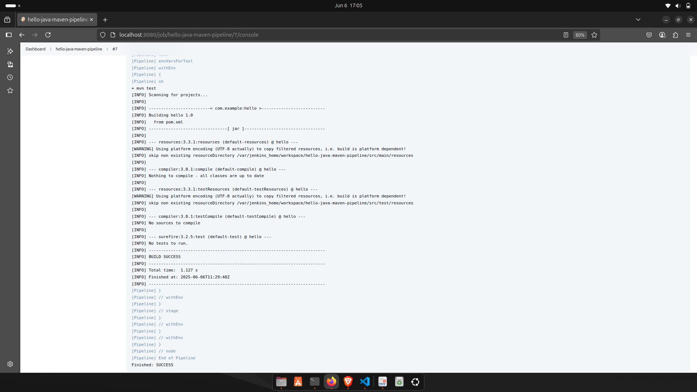

# 🚀 TASK 8: Java Maven Build with Jenkins

## 📌 Objective
To learn how to build a basic Java application using **Maven** and **Jenkins**, simulating a real-world CI/CD setup.

---

## 📁 Project Structure

```

hello-java-maven/
├── src/
│   └── main/
│       └── java/
│           └── HelloWorld.java
├── pom.xml
└── README.md

````

---

## 🧑‍💻 Source Code

### 🔹 HelloWorld.java
```java
public class HelloWorld {
    public static void main(String[] args) {
        System.out.println("Hello, Jenkins + Maven!");
    }
}
````

### 🔹 pom.xml

```xml
<project>
  <modelVersion>4.0.0</modelVersion>
  <groupId>com.example</groupId>
  <artifactId>hello</artifactId>
  <version>1.0</version>
  <build>
    <plugins>
      <plugin>
        <groupId>org.apache.maven.plugins</groupId>
        <artifactId>maven-compiler-plugin</artifactId>
        <version>3.8.1</version>
        <configuration>
          <source>1.8</source>
          <target>1.8</target>
        </configuration>
      </plugin>
    </plugins>
  </build>
</project>
```

---

## 🔧 Jenkins Setup

* Jenkins installed using Docker:

  ```bash
  docker run -p 8080:8080 jenkins/jenkins:lts
  ```

* Maven configured under:
  `Manage Jenkins` → `Global Tool Configuration` → Maven name: `M3`

* GitHub repo used:
  [https://github.com/Debasish-87/hello-java-maven](https://github.com/Debasish-87/hello-java-maven)

---

## 🛠️ Jenkins Pipeline

### 📄 Jenkinsfile

```groovy
pipeline {
    agent any

    tools {
        maven 'M3'
    }

    stages {
        stage('Checkout') {
            steps {
                git branch: 'main', url: 'https://github.com/Debasish-87/hello-java-maven.git'
            }
        }

        stage('Build') {
            steps {
                sh 'mvn clean package'
            }
        }

        stage('Test') {
            steps {
                sh 'mvn test'
            }
        }
    }
}
```

---

## ✅ Build Result

* Jenkins job ran successfully
* Console output shows `BUILD SUCCESS`
* Artifacts generated: `hello-1.0.jar`

---

## 🖼️ Build Success Screenshot



---

## 🙋‍♂️ What I Learned

* How to build Java apps with Maven using Jenkins
* Creating a Jenkins pipeline
* Understanding Maven lifecycle: `clean`, `package`, `test`
* Analyzing console logs and verifying successful builds

---

## 👨‍💻 Author

**Debasish Mohanty**
`DevOps Intern | Future DevSecOps Engineer`

---
